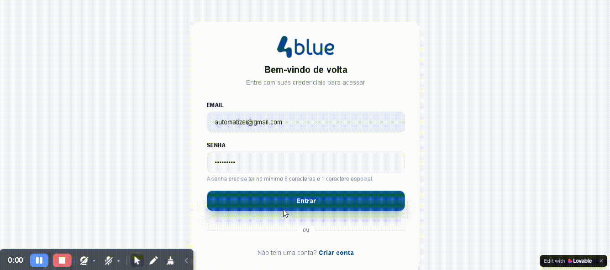
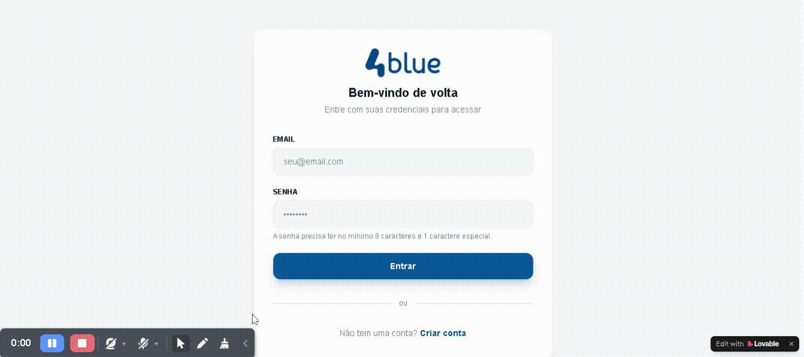
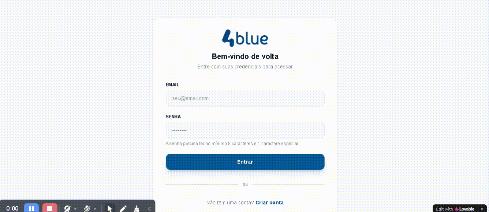
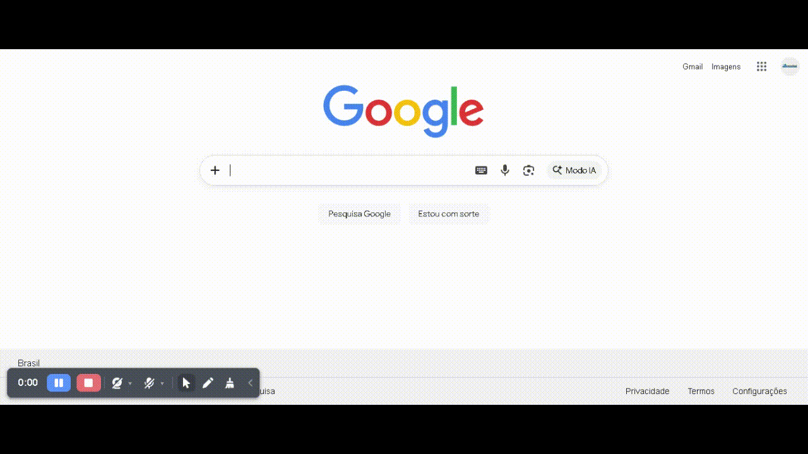
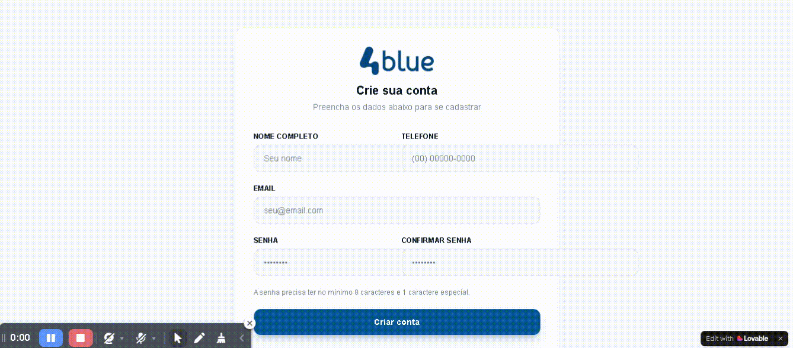

# Teste Técnico – QA Tester - Processo Seletivo – 4blue

# Relatário e testes exploratórios
Este repositório contém relatório de testes exploratórios realizados no sistema:
https://qa-play-sim.lovable.app/

O objetivo da analise foi identificar falhas funcionais, inconsistências de experiência do usuário e possíveis problemas de segurança nas seguintes telas:
- Tela de Login
- Tela de Criação de Conta
- Tela de sucesso

---

# Objetivo da Avaliação
Durante a análise foram avaliados os seguintes aspectos:
- Validação de campos
- Fluxos de autenticação
- Consistência de navegação
- Tratamento de erros
- Regras básicas de negócio
- Possíveis vulnetabilidades de segurança

---

# Estratégia de Testes
Foi utilizada a técnica de **Testes Exploratórios**.

## Abordagem incluiu:
- Testes de campos obrigatórios
- Testes de dados inválidos
- Testes de consistência de fluxo
- Testes de autenticação
- Testes de duplicidade de cadastro
- Testes de comportamento inesperado do sistema

---

# Ambiente de Testes

| Item | Detalhes |
| ---- | -------- |
| Sistema |  4Blue QA Play |
| URL | https://qa-play-sim.lovable.app |
| Navegador | Firefox - 148.0 (64-bits) / Chrome - 145.0.7632.160 (Versão oficial) 64 bits |
| Sistema Operacional | Windows 11 |

---

# Bugs Identificados
Durante os testes exploratórios foram identificados os seguintes defeitos no sistema.

---

## Título:

**BUG-01 → Sistema permite cadastro com campos obrigatórios vazios**

## Descrição:
O sistema permite a criação de contas mesmo quando nenhum campo do formulário de cadastro é preenchido.

## Passos para reproduzir
    1. Acessar página de cadastro
    2. Não preencher nenhum campo
    3. Clicar no botão "Cadastrar"

## Resultado atual:
O sistema redireciona para "/sucesso?op=cadastro", exibindo mensagem "Conta criada com sucesso"

## Resultado esperado:
O resultado deveria impedir o envio do formulário e exibir mensagem informando "Os campos obrigatórios devem ser preenchidos".

## Severidade
Crítico

## Prioridade
Alta

## Evidências

---
---

## Título:
**BUG-02 → Sistema permite cadastro com dados inválidos**

## Descrição:
O sistema permite cadastro utilizando dados inválidos como email em formato incorreto, senha inválida ou asencia de confirmação de senha.

## Passos para reproduzir:
    1. Acessar página de cadastro
    2. Preencher email com formato inválido
    3. Informar senha fora do padrão esperado
    4. Informar confirmação de senha diferente da senha ou não preencher
    5. Clicar no botão "Cadastrar"

## Resultado atual:
O sistema cria a conta e redireciona para "/sucesso?op=cadastro", exibindo mensagem "Conta criada com sucesso"

## Resultado esperado:
O sistema deveria validar:
- formato do email
- regras mínimas de senha
- confirmação de senha
e impedir o cadastro caso os dados sejam inválidos

## Severidade
Alta

## Prioridade
Alta

## Evidências

---
---

## Título:
**BUG-03 → Sitema permite cadastro duplicado**

## Descrição:
O sistema permite criar múltiplas contas utilizando o mesmo email.

## Passos para reproduzir:
    1. Criar uma conta com email válido
    2. Tentar criar novamente utilizando o mesmo email

## resultado atual:
O sistema permiti criar outra conta com mesmo email.

## Resultado esperado:
O sistema deve impedir o cadastro duplicado e exibir mensagem informando "Email já está registrado, use outro email ou faça o login." e permanecer na tela de cadastro

## Severidade
Alta

## Prioridade
Média

## Evidências

---
---

## Título:
**BUG-04 → Sistema apresenta erro inesperado após login válido**

## Descrição:
O sistema exibe mensagem "Erro inesperado", mesmo quando o login é realizado corretamente.

## Passos para reproduzir:
    1. Criar conta com dados válidos.
    2. Realizar login utilizando as credenciais criadas.

## Resultado atual:
O usuário é redirecionado para a tela de Login realizado com sucesso, porem o sistema exibe mensagem informando "Erro inesperado".

## Resultado esperado:
Após o login válido, o sistema deveria exibir apenas a mensagem "Login realizado com sucesso", sem apresentar erros.

## Severidade:
Média.

## Prioridade:
Média.

## Evidências

---
---

## Título:
**BUG-05 → Acesso direto a página Login realizado com sucesso**

## Descrição:
O sistema permite acessar diretamente a página "/sucesso?op=login" através da URL, sem qualquer autenticação prévia.

## Passos para reproduzir:
    1. Abrir o navegador sem estar autenticado
    2. Acessar diretamente a URL: https://qa-play-sim.lovable.app/sucesso?op=login.

## Resultado atual:
A página Login realizado com sucesso é exibida.

## Resultado Esperado
O sistema deveria verificar se existe sessão ativa e redirecionar para a página de login caso o usuário não esteja autenticado.

## Severidade:
Média

## Prioridade:
Alta

## Evidências

---
---

## Título
**BUG-06 → Campos do formulário se sobrepõem no layout desktop**

## Descrição
Durante a execução dos testes foi observado que os campos do formulário apresentam sobreposição no layout desktop, causando quebra visual e ultrapassando os limites do seu container.

## Passo para reproduzir
    1. Acesar a página de cadastro.
    2. Visualizar a página em resolução padrão.
    3. Observar posicionamento dos campos do formulário.

## Resultado atual
Os campos do formulário se sobrepõem e ultrapassam os limites visuais do layout.

## Resultado esperado
Os campos deveriam respeitar o espaçamento do layout, mantendo alinhamento correto e sem sobreposição.

## Severidade
Baixa

## Prioridade
Baixa

## Evidências
